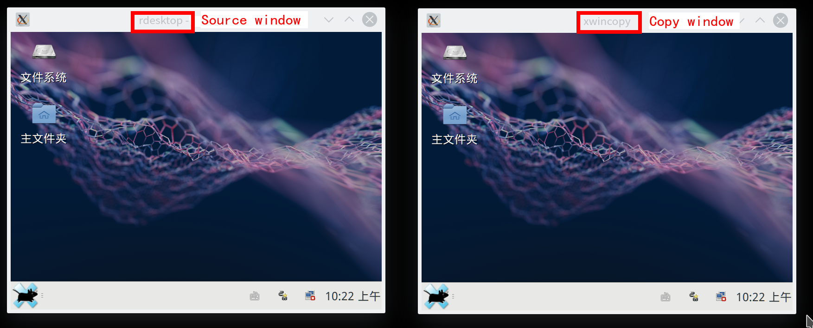

# xwincopy
Copy xlib's window and synchronize in real time

### 功能:
拷贝xlib的窗口并实时同步。  
通过 鼠标点击 选择要拷贝的窗口。  
通过 window id 选择要拷贝的窗口。  
通过 process pid 选择要拷贝的窗口。  
可以zoom放大缩小窗口。  
双击拷贝窗口重置为源窗口大小。  
拖放移动窗口。  

### 使用:
直接运行`xwincopy -h`可得到使用帮助:

	xwincopy: Copy xlib's window and synchronize in real time.
	Usage: xwincopy [options]
	 copy the window by clicking the mouse in that window. By default.
	   -w <wid>: copy the window by window id.
	   -p <pid>: copy the window by process pid.
	   -l: only list window id.
	   -t: show the window tree.
	   -h: help.
		
	xwincopy 	# 运行后根据提示通过鼠标点击选择要拷贝的窗口

源窗口和拷贝窗口大小相同时，有最好的性能和画质。  
缩放时，性能和画质下降，因需循环取缩放后的像素点，暂无更好解决方案。  
如缩放时觉得性能和画质不能接受，可以先调整源窗口的大小，然后双击拷贝窗口重置，这样就达到最好的性能和画质。

